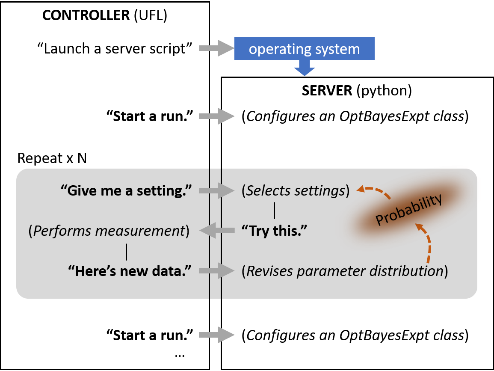
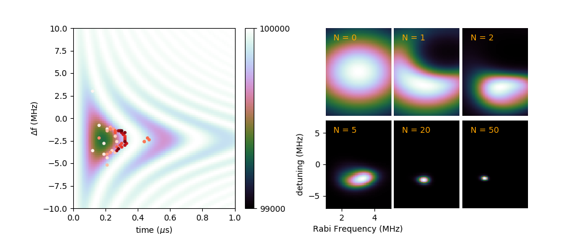
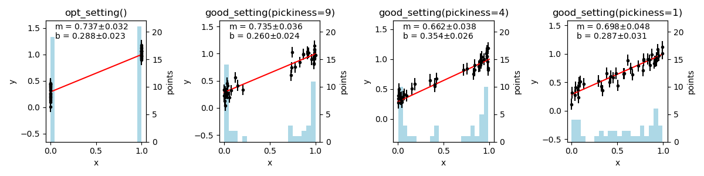

Demos
-----

Finding a Lorentzian peak
~~~~~~~~~~~~~~~~~~~~~~~~~~

Files:
    - ``demos/find_peak/sequentialLorentzian.py``

Features:
    - OptBayesExpt configuration and usage.
    - Known measurement noise

.. figure:: _images/sequentialLorentzian.png
    :alt: Behavior and results of a sequential Bayesian experimental design
        approach to measurement a Lorentzian peak.

Figure 1.  Plots generated by ``demos/find_peak/sequentialLorentzian.py``
illustrating a sequential Bayesian experimental design
approach to measurement of a Lorentzian peak. The unknown parameters are
the peak position and amplitude and the background level, and the peak
width is fixed. Panel (a) shows the true curve in red and the simulated
measurement data after 500 measurements. The signal to noise ratio is
approximately 1.0.  The algorithm focuses measurement resources near the
peak as quantified by the histogram in (c). Measurements far from the peak
reduce uncertainty in the background level.  Panels (b) and (d) illustrate
how the process evolves.  (b) plots the standard deviation of the peak
center, and (d) plots the measurement settings. For the first 50-ish
measurements, the settings are scattered and the standard deviation drops
slowly. After 50-ish measurements, the standard deviation drops quickly and
the settings concentrate on the peak level.  At around 150 measurements, the
system enters a steady-state pattern of settings near the peak with less
frequent measurements of the background.  In this stage, the standard
deviation typically reduces proportional to :math:`1/\sqrt{N}`.

---------------------------------

Files:
    - ``demos/find_peak/seqLor_pdfevolve.py``

Features:
    - OptBayesExpt configuration and usage.
    - Animation of the data collection and of the parameter distribution.

.. figure:: _images/seqLor_pdfevolve.png
   :width: 600px
   :alt: Snapshot from an animation

Figure 2. A snapshot of ``demos/find_peak/seqLor_pdfevolve.py``. This
program animates the evolution of the probability distribution function
as simulated measurement results are incorporated.  Four parameters are
determined: the peak center x0, the peak width d, the peak amplitude A and
the baseline value B. The top panel shows the true curve in red and the
simulated data.  The bottom two panels show 2D views of the 4D parameter
space. As measurement data is incorporated, samples from the parameter
distribution congregate around the true values, which are plotted as red dots.

Measurement speedup
~~~~~~~~~~~~~~~~~~~~~~~~

Files:
    - ``demos/fit_vs_obe_makedata.py``
    - ``demos/fit_vs_obe_plots.py``

Features:
    - OptBayesExpt configuration and usage.
    - Known measurement noise

.. figure:: _images/rootN.png
   :alt: Mechanism of speedup

Figure 3: A different view of the Lorentzian peak problem, contrasting
efficiency differences between experiment designs. The left panel shows results
after 3000 measurements of a spectrum simulated with
``demos/fit_vs_obe_makedata.py`` and plotted with
``demos/fit_vs_obe_plots.py``. The simulated experimental noise
is Gaussian with standard deviation :math:`\sigma = 1`. In the “average
& fit” method, 100 simulated measurements are averaged at each of 30
points, yielding a uniform uncertainty of
:math:`\sigma_y = 1/\sqrt{100}`. In the OptBayesExpt method, the
algorithm focuses attention on the sides of the peak, as shown in the
histogram. The symbol areas are proportional to the weights of the data
points, :math:`1/\sigma^2`. The smallest points correspond to
:math:`\sigma_y = 0.258`, and the largest to
:math:`\sigma_y \approx 0.037.`

The right panel compares the evolution of runs using OptBayesExpt and
average & fit runs.  Faint lines trace the progress of 100 runs, each with
3000 OptBayesExpt measurements and 15 000 average & fit measurements.
Faint lines trace the progress of uncertainty in
:math:`x_0` vs. the number of accumulated measurements: standard deviation
of the :math:`x_0` distribution for OptBayesExpt and standard deviation of
the fit for the average & fit design. Dark lines plot the root-mean-square
difference between the true values and either :math:`x_0` distribution mean
values or the best-fit values. Both the average & fit
technique and the OptBayesExpt method scale like
:math:`\sigma_{x0} \propto 1/\sqrt{N}` (:math:`N` = measurement number)
for large :math:`N`, but the OptBayesExpt requires approximately 4
times fewer measurements to achieve the same uncertainty.

Details: The average & fit method used ``scipy.optimize.curve_fit()``. The
uncertainty plotted here is the square root of the diagonal element in the
covariance matrix. For both methods, the peak
height, background level and peak center are treated as unknowns, and
the half-width line width is fixed at 0.3.

External experiment control
~~~~~~~~~~~~~~~~~~~~~~~~~~~

Files:
    - ``demos/instrument_controller.py``
    - ``demos/server_script.py``

Features:
    - Simulated measurements and Bayesian experiment design run in separate
      processes.
    - OBE_Server configuration an usage

This demo simulates a user's instrumentation control program that
communicates with an external OptBayesExpt class.  The goal is to allow
existing instrumentation software written in the user's favorite
language (UFL) to use the ``optbayesexpt`` package with python script and a
little bit of UFL programming.

Figure 4.
In this example, the ``instrument_controller.py`` program first launches the
``server_script.py`` script, which then runs "in the background" in a
separate process.  Then, the controller performs three measurement runs,
each with a differently configured OptBayesExpt object.  The flowchart of
one such run is shown in the figure.

Tuning a pi pulse
~~~~~~~~~~~~~~~~~

Files:
    - ``demos/pipulse/pipulse.py``

Features:
    - Multiple setting "knobs"
    - Parameter distribution evolution
    - Known measurement noise

Figure 5: This demo, ``demos/pipulse/pipulse.py`` features a simulated
measurement with more than one control setting. Radio frequency pulses can
be used to manipulate spins, but in order to be accurate, both the
duration and frequency of the radio-frequency pulse must be tuned. On
the left, the background image displays the model photon counts for
optically detected spin manipulation for different pulse durations
(x-axis) and amounts of detuning from the spin's natural resonance frequency
(y-axis). In the background image, white indicates the expected
measurement result for spin up and
black, spin down. Points indicate simulated measurement settings, with
sequence in order from white to dark red. Simulated measurements have
1\ :math:`\sigma` uncertainties of :math:`\sqrt{N} \approx 316`.
The right panel displays the evolution of the probability distribution
function with the number “N” of measurements.

Slope Intercept
~~~~~~~~~~~~~~~

Files:
    - ``demos/line_plus_noise/line_plus_noise.py``
    - ``demos/line_plus_noise/obe_noiseparam.py``

Features:
    - Comparison of setting selection methods
    - Unknown measurement noise
    - Customizing OptBayesExpt using a child class

Figure 6: This demo ``demos/line_plus_noise/line_plus_noise.py``, highlights
the difference between algorithms for measurement selection ``opt_setting()``
method used in the first panel selects the setting with the highest
*utility* :math:`\max[U(x)]`.  As expected for a linear model, points at the
ends of x's range are most effective.  The other three panels
use the more flexible ``good_setting()`` method,
selecting settings with a probability based on the *utility* and the
``pickiness`` parameter. The 2nd through 4th panels show that the
``good_setting()`` algorithm selects more diverse setting values as the
``pickiness`` is reduced. Note also that the standard deviations
increase from left to right as measurement resources are diverted away
from reducing uncertainty. Each run uses 100 points. See
``demos/line_plus_noise.py``.

Additionally, this demo treats the measurement uncertainty as an unknown.
The ``OptBayesExptNoiseParameter`` class provided in
``demos/line_plus_noise/obe_noiseparam.py`` inherits from ``OptBayesExpt``.
An added attribute, ``OptBayesExptNoiseParameter.noise_parameter_index``
identifies the noise parameter among the model parameters.  The child class
also adapts the ``likelihood()`` and ``yvar_noise_model()`` methods to
handle distributions of the measurement uncertainty parameter.

A Lockin Amplifier
~~~~~~~~~~~~~~~~~~

Files:
    - ``demos/lockin/lockin_of_coil.py``

Features:
    - Multiple measurement inputs
    - Setting-dependent measurement cost
    - Unknown measurement noise
    - Customizing OptBayesExpt using a child class
    - ``trace_sort()`` utility

.. figure:: _images/lockin.png
   :alt: simulated measurements using a lockin amplifier

Figure 7. This demo simulates lockin measurement of a coil of wire.
The circuit model
consists of an inductance *L* in series with resistance *R*, and also a
capacitance *C* in parallel with *L* and *R* to represent turn-to-turn
capacitance. The lone setting is the measurement frequency and the
instrument outputs are the *X* and *Y* channels, corresponding to the real
and imaginary parts of the coil's complex impedance.  Panel (a) shows the
"true" frequency response of the coil with raw data plotted.

Panel (b)
shows the effects of a setting-dependent cost model on the setting choices.
In the cost model used here, the cost of repeating a measurement is 1 time
constant, and the cost of changing settings is assumed to be 5 time constants:
4 for settling time plus 1 for the measurement. The effect of adding a
time cost for changing settings is that the settings exhibit a "sticky"
behavior.  After a few short measurements, settings tend to be chosen in
long periods of repeated measurements with infrequent setting changes.
Please note that this cost model is just a sketch for demonstration purposes.
It may not be suitable for any actual measurements.

Panel (c)
demonstrates the use of the ``optbayesexpt.trace_sort()`` utility function.
The ``trace_sort()`` function sorts the raw data and computes the mean and
standard deviation of mean, :math:`\sigma` at each setting.  Symbol
areas are proportional to the statistical *weight* = :math:`1/\sigma^2` of
the mean.

Opinion:

    The aesthetic problem that ``trace_sort()`` addresses can be seen in panel
    (a) and in similar plots of raw data. While these plots are honest
    representations,
    the visual impact of large collections of markers disagrees with the
    fact that many points produce the most precisely known mean values. After
    computing mean values and standard deviations, :math:`\sigma`, the next
    step traditionally would be an error bar plot, but the error bars
    have a similar visual problem: the most important points on the plot
    have small error bars and low visual impact, while less important plots
    have big, eye-catching error bars.  By plotting mean values with symbol
    areas proportional so statistical weight, the visual impact of the data
    is in harmony with its importance.

A Sweeper
~~~~~~~~~

Files:
    - ``demos/sweeper/sweeper.py``
    - ``demos/sweeper/obe_sweeper.py``

Features:
    - Swept-setting measurements
    - Separation of measurement-point settings from sweep property controls
    - Many data points per measurement
    - Unknown measurement noise
    - Setting-dependent cost

.. figure:: _images/sweeper.png
   :alt: simulated measurements using a swept-frequency spectrometer

Figure 8. This demo takes on the challenge of a spectrometer-like instrument
that accepts sweep limits as controls and returns data as arrays of
settings and corresponding results. The model function is the tried-and-true
Lorentzian peak with the peak center, amplitude, background, and noise
:math:`\sigma` as unknown parameters and with constant peak width. The cost
function includes a constant value for the cost of a new sweep plus a term
corresponding to the length of the sweep.  In this simulation, the setup
cost is the same as the cost of 5 data points.

Panel (a) shows the true curve in red with the simulated measurement data,
which is concentrated around the peak position as shown by the histogram in
(c).  Panel (b) shows  the standard deviation of the peak
center distribution vs. the number of accumulated data points.  The
standard deviation begins to drop dramatically after about 300 or 400
measurements. Panel (d) traces the measurement settings. The strategy that
emerges typically begins with a broad sweep followed by shorter sweeps
focused on possible peak positions.  Later in the process, the algorithm
includes an occasional broad sweep, presumably to decrease uncertainty in
the baseline parameter.

Code speedup with numba
~~~~~~~~~~~~~~~~~~~~~~~

Files:
    - ``demos/numba/numbaLorentzian.py``
    - ``numba`` python package required

Features:
    - Improved execution time using pre-compilation.

This ``numbaLorentzian.py`` script demonstrates the use of ``numba`` and its
``@njit`` decorator to accelerate the more numerics-intensive functions in
optbayesexpt. The purpose of ``numba`` is to pre-compile Python code
just-in-time (jit) so that when the function is called, the CPU runs machine
code without involvement from the Python interpreter.

In ``numbaLorentzian.py``, the Boolean variable ``use_jit`` enables
(``use_jit = True``) or disables ( ``use_jit = False``) pre-compilation.
In this demo, we use ``numba`` to pre-compile three of the more numerically
demanding functions in ``optbayesexpt``.

    - ``_gauss_noise_likelihood()`` -- the calculation of likelihood
    - ``my_model_function()`` -- the guts of the experiment model calculation
    - ``_normalized_product()`` -- Bayes' rule multiplication of likelihood
      and prior with normalization.

The output of ``numbaLorentzian.py`` includes a code profile that shows
where the computation time was spent.  Table I below compares execution
times of the most time consuming functions without (``use_jit = False``) and
with (``use_jit = True``) pre-compilation. The times listed represent time
spent on a function, not
counting called functions.  Pre-compilation roughly halved the
execution time of the most time-consuming function, which calculates a
Gaussian likelihood. The most dramatic improvement is in calculation of the
model function which was sped up by nearly a factor of five.

.. centered::
   Table I.

.. table::

   =========  ========  =========================
   uses jit
   -------------------  -------------------------
   ``False``  ``True``
   time (s)   time (s)  filename:lineno(function)
   =========  ========  =========================
   4.150      2.000     obe_base.py:199(_gauss_noise_likelihood)
   2.724      0.538     numbaLorentzian.py:101(my_model_function)
   2.259      1.747     {method 'choice' of
                        'numpy.random._generator.Generator' objects}
   0.850      0.827     particlepdf.py:129(_normalized_product)
   ...        ...       ...
   13.109 s   8.322 s   Total
   =========  ========  =========================

The overall execution time is shown in the last line of Table I. With
``numba`` pre-compilation, there is a significant, but not spectacular
decrease in execution time.

Speculation:

    Compared to examples in the numba documentation
    (see https://numba.pydata.org/numba-doc/latest/user/5minguide.html#how-to-measure-the-performance-of-numba) the acceleration in this
    example seems small.  One possible explanation for the small speed
    increase is that much of the computation already takes advantage of math
    using numpy arrays, which are pre-compiled operations.

